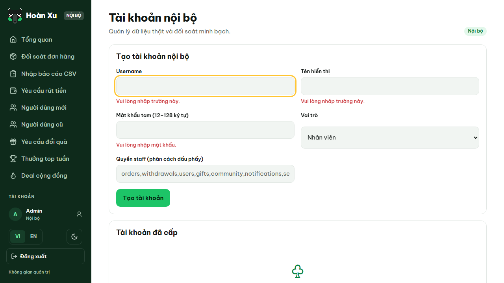
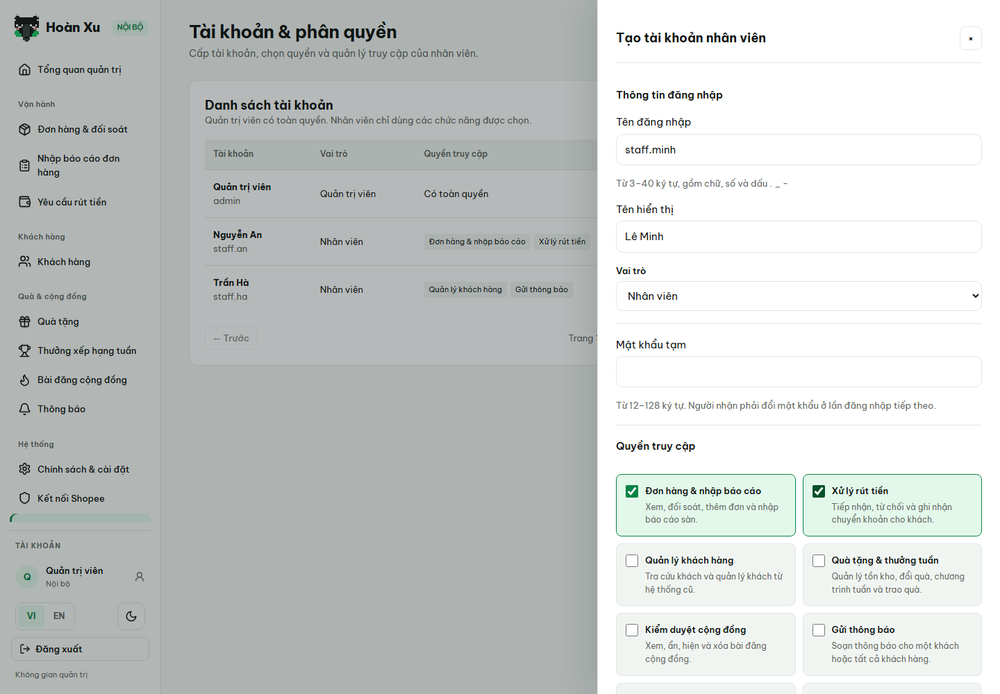
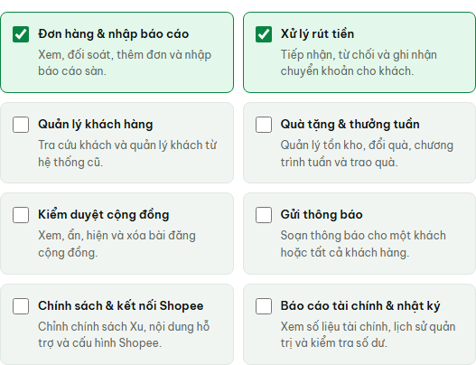
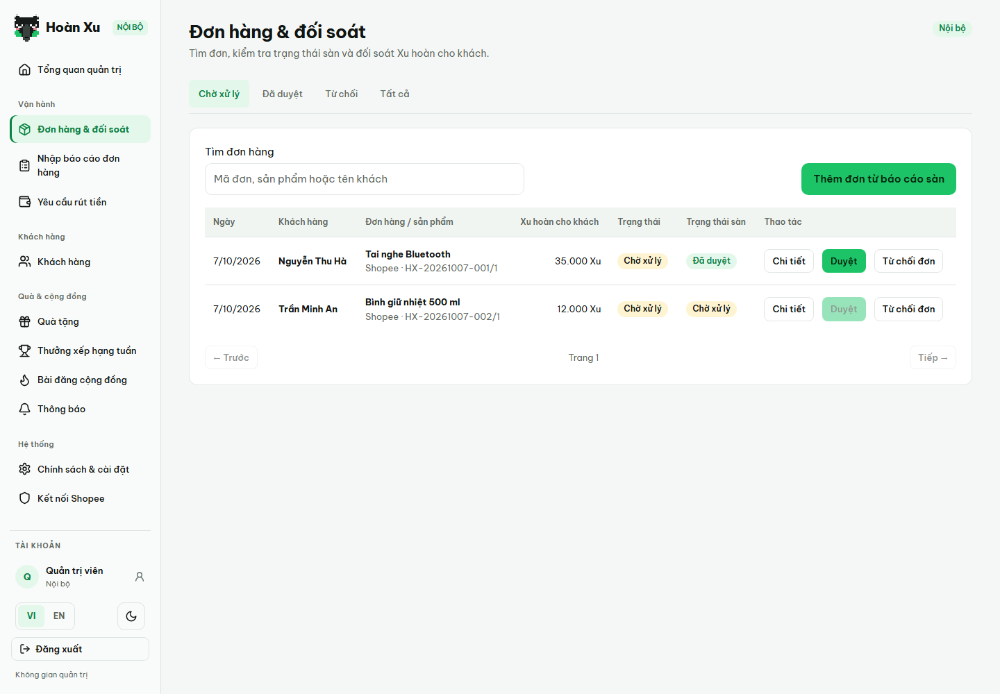
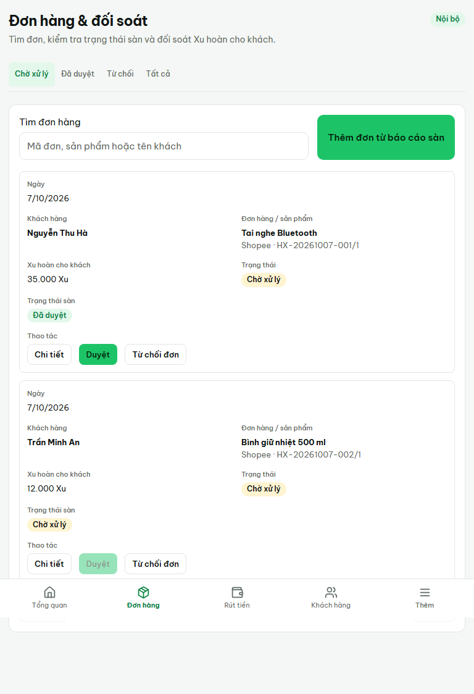
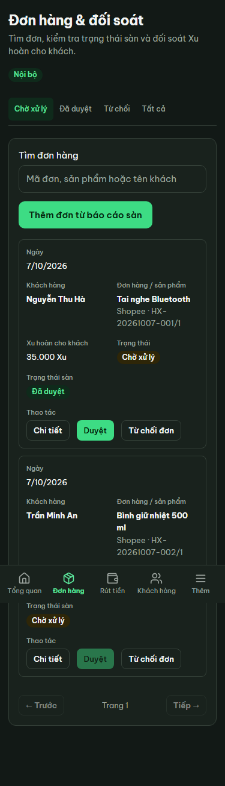

# Thiết kế lại quản trị Hoàn Xu — 07/10/2026

## Căn cứ và phạm vi

Triển khai kế hoạch đã được chủ sản phẩm chốt, theo `redesign-existing-projects` và `uxruler`. Căn cứ là mã nguồn, kiểm thử tích hợp và giao diện chạy với fixture. Chưa có phỏng vấn nhân viên, số liệu thời gian thao tác hay kết quả nghiệm thu với admin thật.

Các vấn đề ban đầu: 14 mục menu ngang cấp; hai danh sách khách tách rời; bảng tài chính dàn trải; biểu mẫu luôn mở; tên màn và nhãn kỹ thuật khó đọc; quyền nhân viên nhập bằng chuỗi; Tổng quan yêu cầu `audit` khiến nhân viên thiếu quyền gặp lỗi.

## Kết quả triển khai

- Menu theo bốn nhóm, tự ẩn chức năng không được cấp quyền. Tổng quan quản trị đưa việc chờ xử lý lên trước; nhân viên không có `audit` không tải báo cáo tài chính. Số việc chờ tính cả khách đăng ký và khách cũ; số liệu tài chính giữ phạm vi và công thức hiện hữu.
- Đơn hàng & đối soát có tìm mã đơn/sản phẩm/tên khách, lọc trạng thái; tài chính và mã kỹ thuật ở chi tiết. Thêm đơn mở theo yêu cầu. Nút từ chối có tên đúng hành động.
- Yêu cầu rút tiền có năm nhóm trạng thái. Trong yêu cầu đang xử lý, admin tải bằng chứng và nhập mã giao dịch; ID tệp gắn tự động. Bản xem lại hiển thị khách, ngân hàng, số tài khoản, người nhận và số tiền. Lỗi upload giữ form; kết quả chuyển khoản chưa rõ khóa dữ liệu và thử lại cùng mã chống gửi trùng.
- Khách hàng có hai tab giữ URL cũ. Tìm kiếm có độ trễ, trạng thái tìm kiếm/trang nằm trong URL; liên kết quay lại giữ bộ lọc. Số dư bổ sung và thứ hạng mở theo yêu cầu. Xem đơn khách yêu cầu cả `users` và `orders`.
- Nhập báo cáo chỉ tải file khi bấm Xem trước. Có xác nhận nhập, lịch sử/tổng hợp lỗi, phân trang dòng báo cáo, file mẫu và ánh xạ JSON nâng cao.
- Thông báo ưu tiên danh sách đã gửi. Soạn thông báo chọn tất cả hoặc tìm một người nhận bằng tên/email, xem lại trước khi gửi; chỉ cần quyền `notifications`.
- Quà tặng có yêu cầu đổi quà và danh mục/tồn kho. Thưởng tuần tách cấu hình, chốt người thắng và trao quà. Cài đặt chia năm phần; Shopee tách phiên kết nối và cấu hình. Nhật ký hiển thị tên người thực hiện, tên thao tác và chi tiết thay cho JSON trải trong bảng.
- Tài khoản & phân quyền ưu tiên danh sách. Tạo nhân viên mặc định không quyền, dùng tám ô tick có mô tả; quản trị viên có toàn quyền. Chỉnh quyền, đặt lại mật khẩu và khóa/mở khóa là ba thao tác độc lập. Cho phép bỏ toàn bộ quyền.
- CSS admin riêng, hỗ trợ sáng/tối, bảng tóm tắt trên mobile, drawer toàn chiều rộng, focus bàn phím, tải/trống/lỗi và cảnh báo bỏ bản nháp. Giữ Be Vietnam Pro, icon và màu xanh thương hiệu.

## API và bảo mật

| API | Thay đổi |
| --- | --- |
| `PUT /admin/internal-accounts/{id}/permissions` | Nhận `{ permissions: [...] }`, thay quyền độc lập, cho phép `[]`. |
| `POST /admin/internal-accounts/{id}/reset-password` | Nhận `{ password }`, không thay quyền. |
| `PATCH /admin/internal-accounts/{id}/status` | Nhận `{ blocked }`, không thay quyền/mật khẩu. |
| `GET /admin/work-queues` | Chỉ trả số việc của phân hệ được phép xem, cả hai nhóm khách. |
| `GET /admin/notification-recipients?q=...` | Tìm người nhận bằng quyền notifications; chỉ trả ID/tên/email và phân trang. |
| Danh sách đơn/rút tiền | `q` và `status` lọc trước phân trang. |
| Nhật ký quản trị | Thêm `actorName`. |

Ba thao tác tài khoản mới chỉ dành cho admin, giữ CSRF/xác thực mật khẩu gần đây/chặn tự thao tác, khóa hàng trong giao dịch, ghi nhật ký và thu hồi phiên đích. Endpoint reset cũ tiếp tục tương thích. OpenAPI frontend/backend đồng bộ; kiểu frontend sinh lại; mutation cập nhật cache liên quan. Không thêm migration cho phần admin hoặc thay công thức tiền/Xu/thuế/quy tắc duyệt.

## Ảnh trước/sau

Ảnh là giao diện thực được render với dữ liệu kiểm thử, không phải dữ liệu vận hành. Ảnh trước được lưu ở lần kiểm thử đầu, có lỗi xác thực vì test mới chưa tìm thấy ô tick. Ảnh sau minh họa menu mới và form tạo nhân viên.

## Kiểm chứng

| Kiểm tra | Kết quả |
| --- | --- |
| Typecheck / production build | Qua; build production thực hiện trong runner E2E và CSP. |
| Dịch VI/EN | `npm run check:i18n` qua, bổ sung nhãn động nhật ký/quyền/menu vào cả hai catalog. |
| OpenAPI | Hai hợp đồng có cùng SHA-256; `npm run generate` qua. |
| Script tests | 13/13 qua, gồm cache sau thao tác quyền/mật khẩu/trạng thái và hàng đợi công việc. |
| Backend | `./tests/run.ps1` qua, runner nạp 79 tệp kiểm thử; database test riêng; `go vet` qua. |
| CSP development / production | 5 qua, 3 bỏ qua theo điều kiện runtime/mobile của bộ test. |
| E2E toàn dự án | 378 qua, 6 bỏ qua do ma trận viewport lặp; không có test thất bại. Lượt chạy `e2e-1791389220149-35112`. |
| Giao diện sau sửa hồi quy | 40 test khách hàng/phân quyền và 40 test quà/thưởng/chính sách qua trên desktop/mobile. |
| Rút tiền xác thực lại | 2/2 qua: sai mật khẩu giữ form, upload/payment gửi lại nguyên dữ liệu và key, dùng CSRF mới, không gửi trùng khi bấm hai lần. |
| Kiểm thử sau tinh chỉnh cuối | 14/14 qua; mẫu JSON khách cũ mặc định thu gọn, vẫn tải mẫu/xem trước/nhập được; thưởng tuần và xác thực lại rút tiền giữ đúng luồng. Lượt `e2e-1791389590757-23652`. |
| Ma trận admin | 375/768/1440px × sáng/tối, không tràn ngang, drawer nằm trong viewport, focus bàn phím; ảnh thực ở trên. Sáu trường hợp lặp ở project mobile được bỏ qua vì viewport đã đặt riêng trong project desktop. |

Lần chạy backend đầu có lỗi không ổn định trong `TestWorkersReuseTabsAndRejectLateResponses/remote` khi fixture Chrome còn ở trạng thái `checking`; chạy riêng ba lần vẫn tái hiện. Lần chạy toàn bộ cuối đã qua, không sửa mã trình duyệt để che lỗi này. Đây là ghi chú về độ ổn định fixture, cần xem lại nếu tái xuất hiện.

Kiểm thử tự động dùng fixture và database test chứng minh hành vi đã mô tả; không thay thế nghiệm thu Shopee/ngân hàng thật hay nghiên cứu người dùng. Các test live Shopee cần cấu hình nghiệm thu riêng.

Các artifact runner nằm trong `tests/results/` (được gitignore); ảnh bàn giao đã sao chép sang `docs/admin-redesign/` để lưu cùng mã nguồn. Lượt kiểm thử bổ sung xác thực lại rút tiền: `e2e-1791389360720-32464`. Lượt CSP: `csp-development-1791388903681-25040`, `csp-production-1791388940175-32164`.

## Nghiệm thu với admin thật trước phát hành

| Việc | Cách thử | Tiêu chí |
| --- | --- | --- |
| Tìm đơn | Từ Tổng quan, tìm bằng mã đơn và tên khách, mở chi tiết. | Đúng chức năng trong tối đa hai lần chọn menu. |
| Xử lý rút tiền | Nhận yêu cầu, tải bằng chứng, xem lại, xác nhận đã chuyển. | Không sao chép/nhập ID tệp; kiểm tra đúng tài khoản/số tiền. |
| Tìm khách cũ | Mở Khách hàng, tab hệ thống cũ, tìm khách, xem đơn, quay lại. | Giữ đúng tab/từ khóa/trang. |
| Tạo nhân viên | Tạo với hai quyền, sau đó thử tài khoản không quyền. | Không nhập chuỗi quyền; menu/Tổng quan đúng quyền. |
| Đổi quyền | Bỏ/thêm quyền, kiểm tra phiên cũ; thử reset mật khẩu và khóa/mở khóa. | Ba thao tác độc lập, không làm mất quyền ngoài ý muốn. |

Ghi số lần chọn menu, thành công/thất bại, chỗ nhầm và thời gian từng việc. Chưa thực hiện phiên nghiệm thu này, chưa phát hành.

## Bổ sung 08/10/2026: giữ vị trí cuộn menu

Menu lưu vị trí cuộn theo tài khoản và khu vực admin/khách hàng trong phiên trình duyệt, khôi phục khi đổi màn hoặc mở lại ngăn kéo mobile. Link điều hướng tắt cuộn tự động; đặt focus khi mở/đóng menu không cuộn trang.

Kiểm thử hồi quy tái hiện menu trở về 0 trên cả desktop/mobile trước khi sửa. Sau sửa, 6/6 kiểm thử điều hướng qua (`e2e-1791394210900-37056`); typecheck và production build qua. Lượt E2E toàn dự án `e2e-1791394274031-30796`: 398 qua, 6 bỏ qua, 2 lỗi cùng ca hiển thị hạng khách hàng ở `cashback-tiers.spec.ts:229` (desktop/mobile), không tìm thấy câu “1.500.000 Xu vàng để lên hạng Kim cương”. Các kiểm thử điều hướng và admin đều qua.
